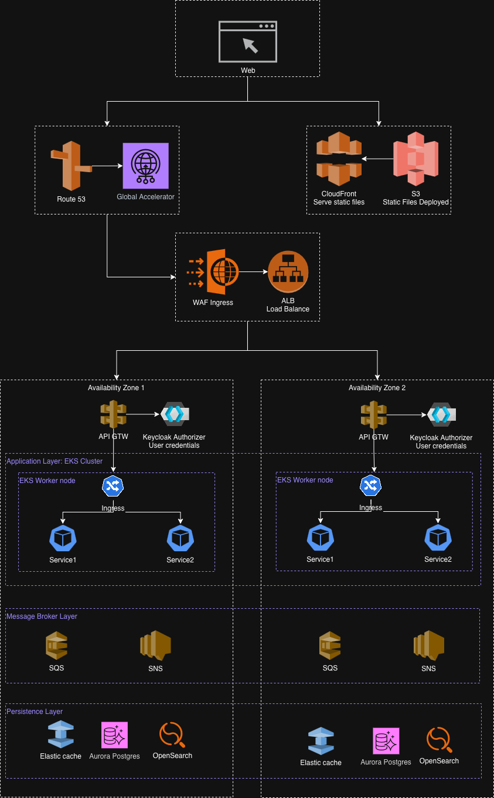
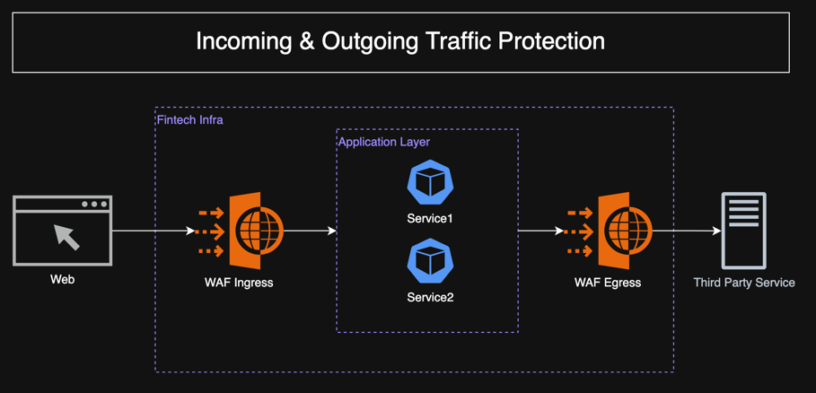
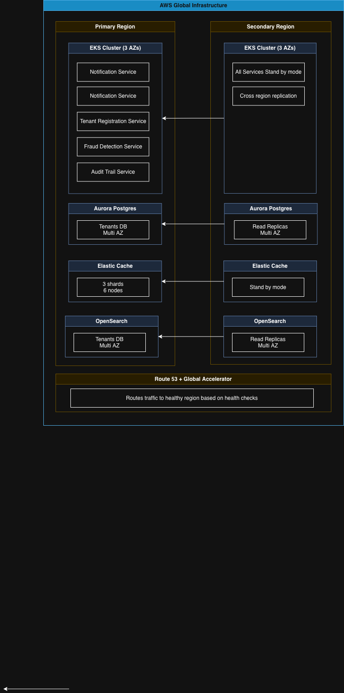
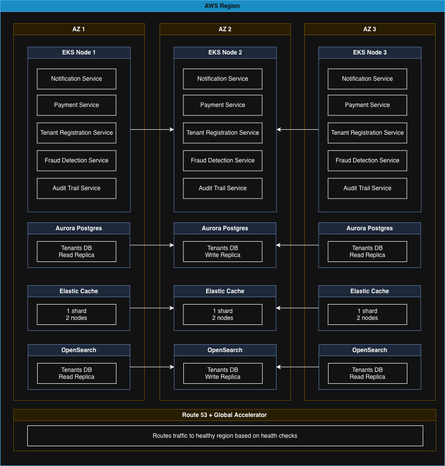
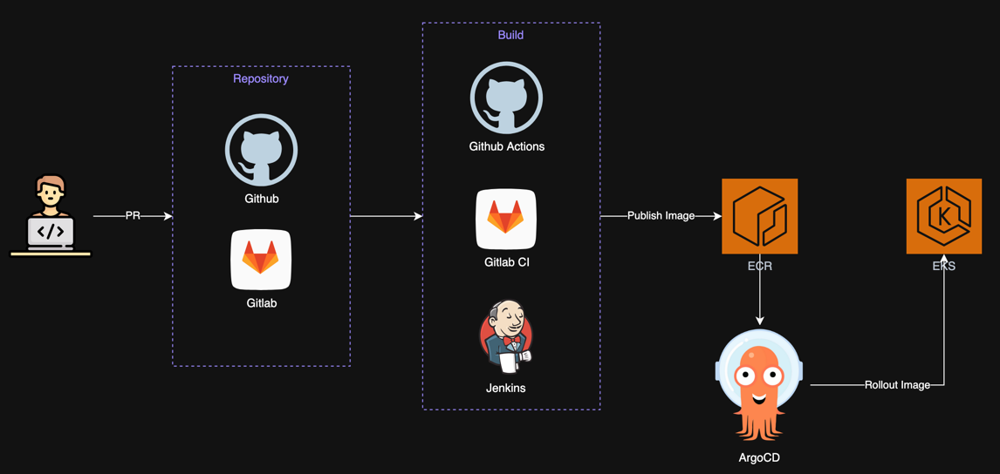
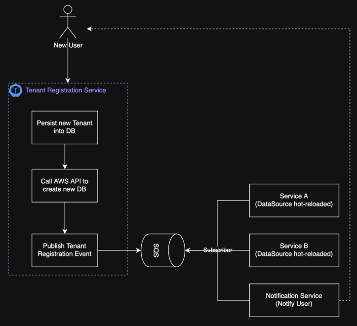
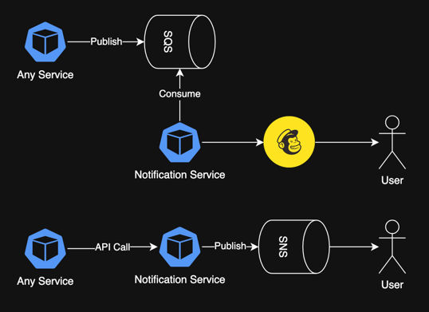
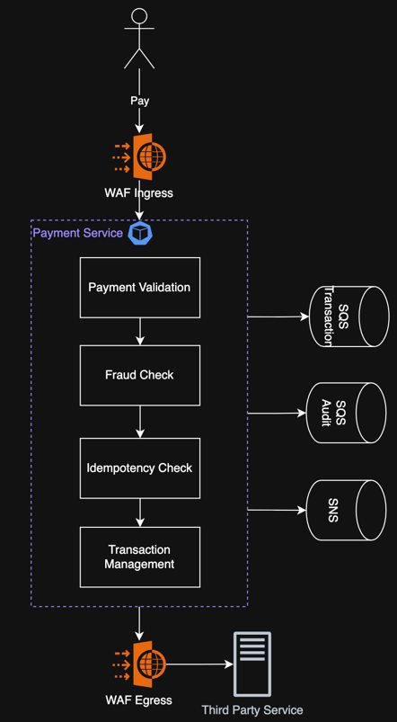
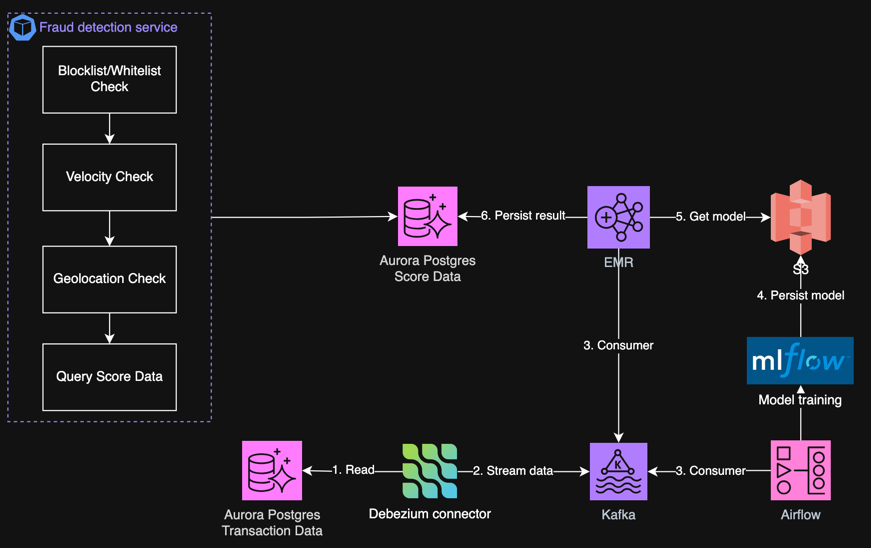
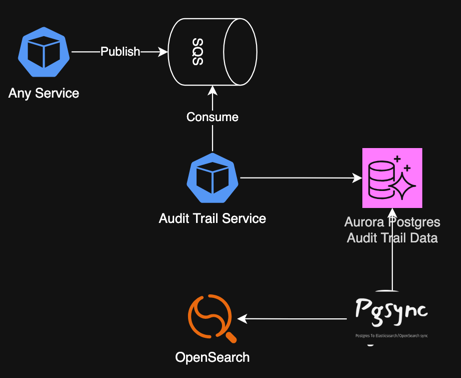

# 1. Requirements

## 1.1 Problem Statement and Context

A fintech is developing a payment platform that will allow customers to:

* Register accounts and user profiles (customers and merchants).
* Perform payments between users.
* Query and generate financial statements and reports.
* Integrate with external payment gateways (e.g., banks, credit cards).
* Send notifications (email, push).
* Handle massive operations (e.g., processing thousands of daily payments).

The system must be multi-tenant, support rapid growth, and ensure high availability, auditability, and security of sensitive data.

## 1.2 Problem space

The fintech payment platform faces several critical challenges that must be addressed in the architecture design:

### Transaction Volume and Performance
- The platform must handle massive daily transaction volumes. 
- Payment processing cannot be delayed, as users expect immediate confirmation. 
- The system must support peak loads during business hours and special events (e.g., Black Friday, salary payment days) without degradation.

### Multi-Tenancy Complexity
- Supporting multiple tenants introduces complexity in data isolation, security boundaries, and resource allocation. 
- The architecture must ensure complete data isolation between tenants while maintaining operational efficiency and avoiding resource waste.

### Financial Data Security and Compliance
- Payment platforms handle highly sensitive data including account numbers, transaction histories, user data. 
- The system must comply with strict regulatory requirements such as LGPD.
- Ensure end-to-end encryption, secure key management, and audit trails.

### Integration Challenges
- The platform must integrate with external systems including banks and credit card networks. 
- Each integration has different protocols, authentication mechanisms, response times, and reliability characteristics. 
- The architecture must handle asynchronous responses, timeout scenarios and possible failures.

### Consistency and Auditability
- Financial systems require atomic transactions. 
- Every operation must be auditable with complete traceability of who did what, when, and why. 
- The system needs to support regulatory audits, dispute resolution, and fraud investigation.

### Availability and Disaster Recovery
- Payment platforms are critical systems where downtime directly impacts revenue and customer trust. 
- The architecture must achieve 99.9% or higher availability through redundancy, automatic failover, and disaster recovery capabilities. 
- This includes multi-region deployment, database replication.

### Real-Time Notifications and Communication
- Users expect immediate notifications for payment confirmations, security alerts. 
- The system must support notification by push and email. 

# 2. Goals

- Scalability: Design a scalable architecture.
- Security: Ensure security best practices.
- High Availability: Achieve 99.9% uptime.
- Auditability: Design for audit trails.
- Multi-Tenancy: Isolate tenant data.

# 3. Non-Goals

- Cryptocurrency or Blockchain Integration.
- International Multi-Currency Support.
- Lending or Credit Services.
- Investment Portfolio Management.
- Physical Card Issuance.
- Legacy System Backward Compatibility.
- White-Label.
- Design Frontend and Mobile Applications.
- Migrate Existing Systems or databases.

# 4. Principles

- Security First: Prioritize security in every design decision.
- API-First: Design APIs before implementation.
- Multi-tenancy: Complete tenant isolation for data and users
- Microservices: Distributed architecture with independent services
- Cloud-Native: Services designed for AWS cloud infrastructure
- Observability: Build in logging, monitoring, and tracing from day one.
- Cloud-Native: Leverage cloud services for scalability, availability, and managed infrastructure.
- Resilience: Design for failure and automatic recovery.
- Auditability: Maintain immutable audit logs.
- Performance: Optimize for critical paths without compromising consistency.

# 5. Overall Architecture

- This is microservices architecture deployed on AWS using EKS for container orchestration.
- Communication between services is done via REST APIs or event-driven messaging.

## 5.1 Incoming & Outgoing Traffic Protection

- All incoming requests from frontend clients MUST pass through AWS WAF (ingress) before reaching any backend service.
- All outgoing requests to external third-party services (banks, payment gateways, credit card networks) MUST pass through AWS WAF (egress) for inspection and protection.

**Rules**:
- Block known malicious IPs.
- Rate limit per IP.
- Rate limit per tenant. 
- SQL Injection protection.
- XSS protection.
- Geo-blocking for unsupported countries.

**Features**:
- OWASP Top 10 protection (https://owasp.org/).
- DDoS mitigation via AWS Shield.
- Geo-blocking for Brazil + supported regions.
- Bot detection and CAPTCHA challenges.

**Outgoing Traffic Error Handling**
- Circuit Breaker:
  - Opens after 5 consecutive failures.
  - Half-open state after 1 minute.
  - Fail fast without calling external service.
  - Queue payments for later processing.

- Retry Strategy:
  - Exponential backoff: 1s → 2s → 4s.
  - Maximum 3 retry attempts.
  - Total timeout: ~7 seconds.
  - Idempotency keys prevent duplicate charges.

- Fallback Mechanisms:
  - Primary gateway → Secondary gateway → Queue for manual processing.

- Dead Letter Queue (DLQ):
  - Store failed payments after retry exhaustion.
  - Operations team reviews daily.
  - Manual retry or customer contact for resolution.

## 5.2 Sensitive Data Protection & LGPD Compliance

**Data Encryption**
- Encryption: TLS 1.3 for all communication.
- PII Encryption: Application-level encryption for user sensitive data and bank details.
- Use AWS KMS for key management and rotation.

**LGPD Compliance**
- Data Minimization: Only collect necessary data for financial transactions.
- Consent Management: Explicit user opt-in with audit trail (purpose, timestamp, IP address).
- Right to Access: API to export all user data (profile, transactions).
- Right to Deletion: Anonymize financial records (compliance), delete non-essential data.
- Data Retention: 5 years for transactions (regulatory), automated cleanup after expiration.

## 5.3 Authentication & Authorization
- Keycloak: OAuth2/OpenID Connect with JWT tokens.
- MFA: Required for large transactions (>R$1000).
- RBAC: Role-based permissions (user, admin, merchant).
- Token Expiry: 1 hour access token, 24 hour refresh token.

## 5.4 Deployment

### Deployment Multi Region
- Deploy in multiple AWS regions (e.g., us-east-1, sa-east-1) for disaster recovery and low latency.
- Use AWS Global Accelerator for global traffic routing to the nearest healthy region.

### Deployment Single Region Multi AZ
- Each region deploys EKS clusters across three availability zones (AZs) for high availability.
- Use AWS Global Accelerator for global traffic routing to the nearest healthy region.

## 5.5 CI/CD

## 5.6 Microservices 

Here are the key microservices that make up the fintech payment platform:

### Tenant Registration Service
- Automated onboarding service to provision new tenant databases, configurations, and resources.
- Trigger auto reload database connections in other microservices.

### Notification Service
- Handles email and push notifications.
- Integrates with Mailchimp for email and SNS for push notifications.
- Integrates with SQS to queue notification requests.

### Payment Service
- Process payments between users.
- Transaction validation and execution.
- Integration with external payment gateways (banks, credit cards).
- Payment idempotency handling.

### Fraud Detection Service

- Transaction risk scoring with real-time ML-based anomaly detection.
- Velocity checks to detect suspicious transaction frequency and patterns.
- Device fingerprinting and geolocation intelligence.
- Configurable rule engine with blacklist/whitelist management.

**ML-based anomaly detection**
- Use Debezium connectors to stream transaction data changes from Aurora PostgreSQL to Kafka topics.
- Use Airflow and MLFlow to orchestrate periodic training jobs that consume transaction data from Kafka, train anomaly detection models, and store them in S3.
- EMR clusters run Spark jobs to perform inference on recent transactions, scoring them for fraud risk.
- Fraud scores are written into Aurora PostgreSQL for real-time access by the Fraud Detection Service.

### Audit Trail Service
- Maintain immutable audit logs.
- Track all system operations.
- Support regulatory compliance and investigations.
- Use PGSync to sync data with OpenSearch for querying and analysis.

### Transaction Service
- Record immutable transaction history for all payments.
- Support financial statement generation.
- Provide transaction query APIs (date range, amount, status).
- Integration with Audit Trail Service for compliance.
- Data retention policy (5 years per LGPD).
- Support for transaction exports (CSV, PDF).

## 5.7 Evolution plan
This architecture is designed to evolve over time as new requirements emerge and the platform grows. Key strategies for evolution include:
- Endorsing isolation: Each microservice is designed to be independent, allowing for easy updates, replacements, or additions without impacting other services.
- API Gateway Extensions: Extend API Gateway with new routes and integrations as new services are added.
- Database Scalability: Implement read replicas and sharding strategies for Aurora PostgreSQL as data volume grows.
- Event-Driven Architecture: Leverage event streaming for asynchronous communication and integration with new external systems.
- Cloud-Native Services: Continuously evaluate and adopt new AWS services that enhance scalability, security, and performance.
- Monitoring and Observability: Expand monitoring capabilities to cover new services and components as the architecture evolves.

# 6. Trade-offs

## Microservices vs Monolith

| **Aspect**               | **Monolith**                                          | **Microservices**                                                           | **Trade-off / Notes**                                                                                                                                                |
|--------------------------|-------------------------------------------------------|-----------------------------------------------------------------------------|----------------------------------------------------------------------------------------------------------------------------------------------------------------------|
| **Complexity**           | Lower – single codebase, simpler to develop initially | Higher – many services, distributed system challenges                       | Monolith is easier to start with; microservices require infrastructure for service coordination, deployment, and monitoring                                          |
| **Scalability**          | Limited – entire application scales together          | High – individual services can scale independently                          | Microservices allow precise resource allocation, but add operational complexity                                                                                      |
| **Deployment**           | Simple – deploy the whole application at once         | Flexible – deploy services independently                                    | Microservices enable faster iteration for parts of the system but require CI/CD pipelines and orchestration tools                                                    |
| **Resilience**           | Lower – failure in one part can affect entire app     | Higher – failures are isolated to services                                  | Microservices improve fault tolerance, but require careful handling of inter-service communication                                                                   |
| **Development Speed**    | Faster initially – single team, shared codebase       | Can be faster at scale – multiple teams work on different services          | Monolith is faster for small teams; microservices are better for large, distributed teams                                                                            |
| **Technology Choice**    | Limited – typically one tech stack                    | Flexible – each service can use best-suited tech                            | Microservices allow polyglot programming but increase operational overhead                                                                                           |
| **Testing**              | Easier – end-to-end testing in a single app           | Harder – testing interactions across services                               | Microservices require robust integration and contract testing                                                                                                        |
| **Observability**        | Moderate – single app logs, metrics easier to collect | Critical – must implement distributed tracing, centralized logging, metrics | Microservices require robust observability practices to detect issues across services; Monolith is easier to monitor but harder to isolate root causes in large apps |
| **Operational Overhead** | Low – fewer deployments, less monitoring              | High – service discovery, logging, monitoring, orchestration                | Microservices need more DevOps maturity to manage efficiently                                                                                                        |

## EKS vs ECS

| **Aspect**                     | **ECS (Elastic Container Service)**                                    | **EKS (Elastic Kubernetes Service)**                                  | **Trade-off / Notes**                                                                                                  |
|--------------------------------|------------------------------------------------------------------------|-----------------------------------------------------------------------|------------------------------------------------------------------------------------------------------------------------|
| **Complexity**                 | Lower – managed container orchestration, simpler setup                 | Higher – Kubernetes has steep learning curve                          | ECS is easier for teams new to container orchestration; EKS gives full Kubernetes features but requires more expertise |
| **Flexibility**                | Moderate – AWS-native features, some limitations                       | High – full Kubernetes ecosystem, supports multi-cloud portability    | EKS allows more customization and standard Kubernetes tools; ECS is AWS-specific but simpler                           |
| **Deployment & Management**    | Simpler – integrates tightly with AWS, less operational overhead       | More complex – need to manage clusters, nodes, and Kubernetes objects | ECS is faster to deploy; EKS offers more granular control and standardization                                          |
| **Scalability**                | High – integrates with Auto Scaling, Fargate for serverless containers | High – Kubernetes-native autoscaling, multi-cluster management        | Both scale well; EKS gives more control at cost of complexity                                                          |
| **Community & Ecosystem**      | AWS-focused – smaller ecosystem outside AWS                            | Kubernetes ecosystem – large, active community and tools              | EKS benefits from portability and community support; ECS is simpler but AWS-locked                                     |
| **Observability & Monitoring** | AWS CloudWatch integration, simpler metrics/logs                       | Kubernetes-native tools (Prometheus, Grafana) plus CloudWatch         | ECS is easier to monitor by default; EKS provides more flexibility for advanced observability setups                   |
| **Cost**                       | Lower for small/simple workloads – less management overhead            | Higher – cluster management costs, but flexible with Fargate          | ECS is cost-efficient for simpler use cases; EKS scales better for complex or multi-team environments                  |
| **Operational Overhead**       | Low – managed service, minimal Kubernetes knowledge required           | Higher – need Kubernetes expertise, more components to maintain       | ECS is “easier to run”; EKS offers powerful orchestration but requires DevOps maturity                                 |

## Database per tenant vs Shared Database

| **Aspect**                             | **Database-per-Tenant**                                    | **Shared Database**                                              | **Trade-off / Notes**                                                                     |
|----------------------------------------|------------------------------------------------------------|------------------------------------------------------------------|-------------------------------------------------------------------------------------------|
| **Data Isolation & Security**          | Excellent – full isolation per tenant                      | Moderate – relies on row-level separation                        | Per-tenant DB is safer for compliance; shared DB requires careful access control          |
| **Scalability**                        | High – scale individual tenant DBs independently           | Moderate – fewer databases to manage, easier horizontal scaling  | Shared DB reduces operational overhead but can have noisy neighbor issues                 |
| **Maintenance & Operational Overhead** | Higher – schema changes, backups, and upgrades per DB      | Lower – single schema, single DB to maintain                     | Shared DB is simpler to manage at scale; per-tenant DB needs automation                   |
| **Customizability**                    | High – schema or configuration can differ per tenant       | Low – all tenants share same schema                              | Useful if tenants need unique features or data structures                                 |
| **Cost**                               | Higher – more storage, connections, and resources          | Lower – single DB shared across tenants                          | Shared DB is more cost-efficient, but can impact isolation                                |
| **Performance**                        | High – tenant workloads don’t interfere                    | Moderate – tenants share resources, may cause contention         | Database-per-tenant offers better isolation; shared DB can have “noisy neighbor” issues   |
| **Observability & Monitoring**         | Moderate – per-DB metrics, easier to isolate tenant issues | Moderate – monitoring per tenant requires filtering in shared DB | Easier to detect issues in per-tenant DBs, but shared DB can still be monitored centrally |
| **Deployment Complexity**              | Moderate – each new tenant needs new DB                    | Low – new tenant only adds rows                                  | Shared DB simplifies onboarding; per-tenant DB increases operational steps                |

## Authorization tokens with tenant_id vs Subdomain with tenant_id

| **Aspect**                           | **Token with `tenant_id`**                                   | **Subdomain with `tenant_id`**                                         | **Trade-off / Notes**                                                                                |
|--------------------------------------|--------------------------------------------------------------|------------------------------------------------------------------------|------------------------------------------------------------------------------------------------------|
| **Tenant Identification**            | Explicitly carried in token, verified server-side            | Derived from URL/subdomain, resolved on request                        | Tokens embed tenant info securely; subdomain approach relies on request parsing                      |
| **Security & Isolation**             | High – token validation ensures tenant isolation             | Moderate – subdomain can be spoofed, requires additional server checks | Tokens are less prone to tampering; subdomain approach can be combined with token for extra security |
| **Routing & Multi-Tenant Awareness** | No impact on routing – backend uses token for tenant context | Natural routing – requests automatically mapped to tenant via URL      | Subdomains simplify routing logic; tokens centralize tenant info in authorization layer              |
| **User Experience**                  | Same URL for all tenants                                     | Unique URL per tenant                                                  | Subdomains are easier for branding/custom login pages; tokens don’t affect URL                       |
| **Operational Overhead**             | Moderate – token management, validation, refresh             | Moderate – DNS/subdomain management, SSL certificates per tenant       | Both approaches add overhead in different areas; combining them can increase complexity              |
| **Auditing & Logging**               | High – tenant_id in token allows tracking actions            | Moderate – tenant inferred from request URL                            | Token-based approach gives precise, secure tenant context in logs                                    |
| **Scalability**                      | High – token approach scales with users                      | High – subdomain approach scales with DNS/tenant routing               | Both scale well, but subdomains require proper DNS and routing infrastructure                        |

## 6.1 Major Decisions

### Microservices vs Monolith
- Choose Microservices.
- Microservices let you scale only the components that need more resources (e.g., just the “payment service” during Black Friday).
- Each microservice can be developed, deployed, and updated independently, often by different teams.
- A failure in one microservice (e.g., recommendations service) does not crash the entire system.

### EKS vs ECS
- Choose EKS.
- EKS runs Kubernetes for you — AWS manages the control plane (API server, etcd, scheduler).
- EKS integrates natively with Cluster Autoscaler and Horizontal Pod Autoscaler, adjusting resources automatically.
- EKS is designed for containerized microservices, making it easier to run modern architectures.

### Database per tenant vs Shared Database
- Choose Database per Tenant.
- Each tenant’s data lives in its own dedicated database → no risk of cross-tenant data leaks.
- Heavy usage by one tenant won’t slow down others since queries and workloads are isolated.
- You can upgrade schemas, tune indexes, or apply patches per tenant without impacting others.

### Authorization tokens with tenant_id vs Subdomain with tenant_id
- Choose Authorization tokens with tenant_id.
- Authorization tokens (JWT, OAuth2, etc.) carry the tenant identifier (tenant_id/realm/claims).
- All services can consistently extract tenant_id from authorization → uniform logic across microservices.
- Since every request is tied to an authenticated identity + tenant_id, you get a clear audit trail (who accessed what, from which tenant).

## 6.2 For each key major component

### CloudFront + S3
- Amazon S3 stores static files (e.g., HTML, JS, CSS, media).
- CloudFront CDN serves those files efficiently, caching them at edge locations for low latency.

### Route 53 + Global Accelerator
- Amazon Route 53 provides DNS resolution and routing.
- AWS Global Accelerator ensures optimized global network routing, directing traffic to the nearest healthy endpoint across regions.

### Application Load Balancer (ALB) + Web Application Firewall (WAF)
- WAF should be attached to component that handles HTTP/HTTPs.
- WAF inspects and filter incoming requests to ALB.
- ALB distribute incoming requests to API Gateway.

### API Gateway (in each AZ)
- Manages API requests for all microservices. Acts as a single entry point to expose endpoints.
- Provides features like request validation, throttling, and routing to backend microservices.
- Routing based on URL paths and HTTP methods to appropriate microservices.
- Rate limiting per tenant to prevent abuse.
- API versioning will be managed by microservices themselves.

### Keycloak Authorizer
- Handles user authentication & authorization.
- Ensures only authenticated requests with valid credentials can access protected APIs.
- Likely integrated with API Gateway as a custom authorizer.
- Supports OAuth2, OpenID Connect, and JWT tokens.

### Kubernetes Multi AZ (EKS)
EKS clusters deployed across three availability zones for high availability and fault tolerance.

**EKS Worker Nodes**
- Host containerized applications.
- Provide compute resources for services (scalable per AZ).

**Ingress Controller**
- Manages routing of external traffic to internal Kubernetes services.
- Acts as a single entry point per tenant to expose microservices.

**Microservices**
- Each service is going to handle multiple database connections (one per tenant).
- Services communicate internally through Kubernetes networking.

### Database (per Tenant)
Each tenant has isolated storage & caching components for data separation and performance.

**Aurora PostgreSQL (RDS)**
- Fully managed, high availability with Multi-AZ deployments.
- Scalability with read replicas for read-heavy workloads.
- Strong ACID compliance for financial transactions.
- Advanced security features (encryption at rest/in transit, VPC isolation).
- Automated backups and point-in-time recovery.
- Compatibility with PostgreSQL ecosystem and tools.

**Elastic Cache**
- In-memory data store for low-latency access.
- Supports complex data structures (hashes, sets, sorted sets).
- Built-in replication and failover for high availability.
- Advanced security features (encryption, VPC isolation).
- Seamless integration with AWS services.

### Observability & Monitoring
- Clear separation of concerns: Splunk for logs/traces, Prometheus+Grafana for metrics and real‑time monitoring.
- Leverages native AWS telemetry (CloudWatch, X‑Ray) so instrumentation effort is reduced.
- Centralized logs in Splunk enable rich search, correlation, and retention policies.
- Prometheus provides efficient time-series querying and alerting with Grafana for visualization.
- Use OpenTelemetry for consistent instrumentation across microservices and other infrastructure components.

# 7. Testing strategy

Before creating new tests, we should first ensure that the existing tests are running and passing.
- Increase the coverage of existing integration/contract tests to 80% or more.
- We should not start the migration without having a good coverage of the existing contracts.
- It will reduce the chances of breaking existing functionality during the migration.
- The testes must run in developer environments and CI/CD pipeline.

## Contract tests
- Test API contracts between decomposed microservices (User, Payment, etc.).
- Verify WebSocket message formats and protocols.

## Integration tests
- Try to cover most of the scenarios, e.g. Tenant registration, Payment, Statement, etc.
- Test WebSocket real-time communication flows.
- Run in isolated environments before production deployment.

## Infra tests
- Test CloudFront edge caching effectiveness.
- Validate Global Accelerator routing behavior.

## Performance tests
- Use K6 to simulate the user behavior and check the system's performance.
- Measure database query performance under load.
- Benchmark WebSocket vs HTTP performance in real usage scenarios.
- Track CDN cache hit/miss ratios.
- Execute in staging environment with production-like conditions.

## Chaos tests
- Simulate AWS region failures to test Global Accelerator failover.
- Test WebSocket reconnection strategies during network disruptions.
- Inject latency between services to identify performance bottlenecks.
- Verify system behavior during PGsync failures.
- Execute in isolated production environment during low-traffic periods.

# 8. Observability strategy

Observability-based testing in production (also called "testing in production" or "production testing") uses monitoring, logging, and tracing data to validate system behavior after deployment.

Here are the key approaches:

### Synthetic Monitoring
Collect features metrics (latency, counters, etc) continuously to validate critical user journeys.

### Real User Monitoring 
Track actual user interactions and performance metrics.
- WebSocket connection success rates
- Search result relevance and speed
- Payment processing times
- Statement generation times

### Error Rate Monitoring
Set up alerts for anomalies in.
- WAF blocked requests and attack patterns (ingress and egress)
- API Gateway 4xx/5xx errors
- Authentication/authorization failures
- Payment processing errors
- Database connection failures
- External gateway integration timeouts (bank APIs, credit cards)
- WAF egress rule violations (unauthorized destinations)

### Business Metrics Validation
Monitor business KPIs to detect regressions.
- Product listing success rate
- Search-to-purchase conversion
- User session duration
- Payment success rate
- Statement generation requests

### Trace Analysis
- Correlation IDs to trace requests across microservices end-to-end.
- Identify bottlenecks, failures, and unexpected behavior.

# 9. Technology Stack

## Backend Services

### Primary Language: Scala (Latest Stable Version)
  - Strong static typing for reliability.
  - Functional and Object-Oriented programming paradigms.
  - Excellent concurrency support.
  - Mature ecosystem for web services.

### Framework: ZIO
  - Asynchronous and concurrent programming made easier.
  - Strong type safety and functional programming principles.
  - Auto contained, there is Zero dependency on other libraries.
  - Robust error handling and resource management.

### Build Tool: SBT
  - Native support for Scala projects.
  - Incremental compilation for faster builds.
  - Extensive plugin ecosystem.

### AI Assistant: GitHub Copilot
  - Accelerates coding by suggesting code snippets.
  - Helps with boilerplate code generation.
  - Assists in learning new libraries and frameworks.

## Tests

### K6: Performance Testing
  - Very easy to simulate scenarios.
  - Built-in metrics and reporting.
  - Easy integration with CI/CD pipelines.
  - Native Grafana integration.

### ZIO Test: Official ZIO testing framework
  - Type-safe assertions - Compile-time validation
  - Resource management - Automatic cleanup with ZIO's scoped pattern
  - Test aspects - Reusable cross-cutting concerns (timeout, retry, flaky)
  - Native ZIO integration - No need for Await.result or blocking operations
  - Parallel execution - Tests run concurrently by default

### MockServer: API Mocking
  - Faster Development - No waiting for external sandbox environments
  - Better Test Coverage - Easily simulate edge cases and failures
  - Parallel Testing - Tests don't interfere with each other
  - Cost Savings - Avoid sandbox API call costs
  - Reliability - Tests aren't affected by external API downtime
  - Security Testing - Validate WAF egress rules safely
  - Contract Validation - Ensure API integrations match specifications
  - Debugging - Inspect all requests sent to external APIs

### Toxiproxy: Network Simulation
  - Simulate real-world network failures (latency, timeouts, packet loss).
  - Test retry logic, circuit breakers, and fallback mechanisms.
  - Validate payment idempotency under network disruptions.
  - Ensure multi-tenant isolation during external API failures.
  - Verify WAF egress behavior when external calls are blocked.

# 10. References

* Architecture Anti-Patterns: https://architecture-antipatterns.tech/
* EIP https://www.enterpriseintegrationpatterns.com/
* SOA Patterns https://patterns.arcitura.com/soa-patterns
* API Patterns https://microservice-api-patterns.org/
* Anti-Patterns https://sourcemaking.com/antipatterns/software-development-antipatterns
* Refactoring Patterns https://sourcemaking.com/refactoring/refactorings
* Database Refactoring Patterns https://databaserefactoring.com/
* Data Modelling Redis https://redis.com/blog/nosql-data-modeling/
* Cloud Patterns https://docs.aws.amazon.com/prescriptive-guidance/latest/cloud-design-patterns/introduction.html
* 12 Factors App https://12factor.net/
* Relational DB Patterns https://www.geeksforgeeks.org/design-patterns-for-relational-databases/
* Rendering Patterns https://www.patterns.dev/vanilla/rendering-patterns/
* REST API Design https://blog.stoplight.io/api-design-patterns-for-rest-web-services

[TODO]
- Review whole DOC.
- Review whole requirements.
- continuous deployment.
- Code examples or reference repository.