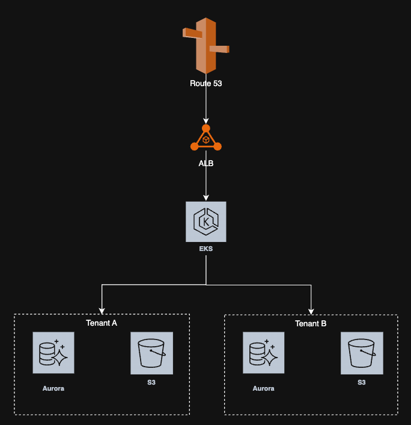
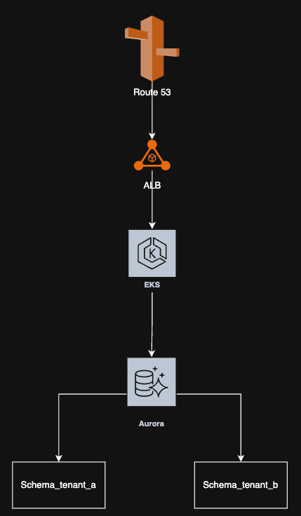
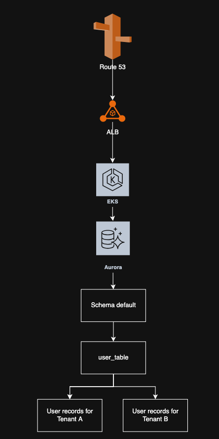
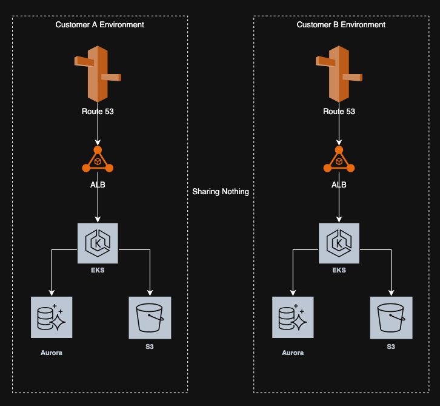

# Single Tenant vs Multi Tenant Applications

# Multi-Tenant

Multiple independent organizations (Tenant A, B, C, etc.) can have completely isolated data, services or infrastructure.

It depends on the use case where you can identify the level of isolation required.

We can have levels of Multi-Tenancy.

## 1. Infrastructure Isolation
Is the highest level of multi-tenancy isolation where each tenant gets completely separate infrastructure resources.

There is minimal sharing of network resources between tenants that needs to be managed carefully to redirect requests to the appropriate tenant's infrastructure.


**Complete Resource Separation**

- Each tenant has dedicated servers, databases, application instances, and storage.
- No shared compute, memory, or storage resources between tenants.
- Each tenant essentially runs on their own isolated environment.

**Network Isolation**

- Separate VPCs, subnets, and security groups per tenant.
- Independent load balancers and networking components.
- Isolated DNS and routing configurations.

**Data Isolation**

- Completely separate database instances per tenants.
- No risk of data leakage between tenants.
- Each tenant can have different database configurations, versions, or types.

**Security**

- Maximum security isolation - breach in one tenant doesn't affect others.
- Independent security policies and access controls.

## 2. Shared Infrastructure, Separate Databases

This is a middle-ground approach where tenants share compute resources but maintain complete data isolation through separate database instances.



**Shared Application Layer**

- Multiple tenants share the same application servers, web servers, and compute instances.
- Apps deployed across shared infrastructure.
- Shared load balancers, networking components, and application runtime.

**Network Sharing**

- Shared VPC, subnets, and networking infrastructure.
- Common security groups with tenant-aware application logic.
- Shared DNS and routing configurations with tenant identification.

**Database Isolation**

- Each tenant has a dedicated database instance or cluster.
- Complete data separation with no risk of cross-tenant data access.
- Independent database configurations, versions, and performance tuning.
- Separate backup, recovery, and maintenance schedules per tenant.

**Security Benefits**

- Data isolation prevents tenant data leakage.
- Application-level tenant validation and access control.


## 3. Shared Database, Separate Schemas

This approach maximizes resource sharing while maintaining logical data separation through database schema isolation.



**Shared Application Layer**

- Multiple tenants share the same application servers, web servers, and compute instances.
- Apps deployed across shared infrastructure.
- Shared load balancers, networking components, and application runtime.

**Network Sharing**

- Shared VPC, subnets, and networking infrastructure.
- Common security groups with tenant-aware application logic.
- Shared DNS and routing configurations with tenant identification.

**Shared Single Database Instance**

- All tenants share the same database server and instance.
- Common database engine, memory, and storage resources.
- Shared connection pooling and database management overhead.
- Cost-effective database licensing and infrastructure.

**Schema-Level Isolation**

- Each tenant gets a dedicated database schema.
- Tables, views, and stored procedures are isolated per tenant.
- Schema naming conventions (e.g., tenant_a.users, tenant_b.users).

**Application-Level Tenant Routing**

- Application logic determines which schema to query based on tenant context.
- Connection strings or query prefixes route to appropriate schema.
- Tenant identification from JWT tokens or session context.
- Dynamic schema switching within the application.

**Security Considerations**

- Database-level access controls prevent cross-tenant data access.
- Application-layer validation ensures tenant isolation.
- Shared database means potential blast radius if compromised.
- Requires careful privilege management and query validation.


## 4. Shared Infrastructure, Shared Database and Shared Tables

This is the most resource-efficient approach where all tenants share the same infrastructure, database, and tables, with tenant isolation achieved through tenant ID columns and row-level security.



**Shared Everything**

- Multiple tenants share the same application servers, web servers, and compute instances.
- All tenants use the same database instance and tables.
- Maximum resource utilization and cost efficiency.
- Single deployment and maintenance.

**Row-Level Tenant Isolation**

- Each table includes a `tenant_id` column to identify data ownership.
- All queries must include tenant ID filtering to ensure data isolation.
- Database views and row-level security policies enforce tenant boundaries.
- Application middleware automatically injects tenant context into queries.

**Table Structure Example**

```sql
-- Users table with tenant isolation
CREATE TABLE users (
    id UUID PRIMARY KEY,
    tenant_id VARCHAR(50) NOT NULL,
    username VARCHAR(100) NOT NULL,
    email VARCHAR(255) NOT NULL,
    INDEX idx_tenant_id (tenant_id),
    INDEX idx_tenant_user (tenant_id, username)
);

-- Orders table with tenant isolation
CREATE TABLE orders (
    id UUID PRIMARY KEY,
    tenant_id VARCHAR(50) NOT NULL,
    user_id BIGINT NOT NULL,
    total_amount DECIMAL(10,2),
    status VARCHAR(50),
    INDEX idx_tenant_id (tenant_id)
);
```

**Application-Level Enforcement**

- Middleware automatically adds tenant context to all database operations.
- ORM/Query builders configured to always include tenant ID filters.
- Database connection pools can be configured with tenant-aware session variables.
- API endpoints validate tenant access through authentication tokens.

**Database-Level Security**

- Row-Level Security (RLS) policies enforce tenant boundaries at the database level.
- Database views that automatically filter by tenant context.
- Database triggers to validate tenant consistency on data modifications.

**Security Considerations**

- Application bugs could potentially expose cross-tenant data.
- Requires extremely careful query construction and validation.
- Database-level policies provide defense-in-depth protection.
- Higher risk of data leakage due to shared table structure.
- Requires comprehensive audit logging and monitoring.


## Routing Mechanism

Independently of the isolation level, you need a way to identify the tenant and route requests to the appropriate tenant's resources.

To redirect tenants to their dedicated infrastructure in an Infrastructure Isolation model, you need a routing mechanism at the entry point:

**DNS-Based Routing** 

Use DNS to direct requests to the appropriate tenant's infrastructure based on subdomains or domain names.
```
# Route 53 Configuration
- tenant-a.yourapp.com -> ALB-A (10.1.0.0/16)
- tenant-b.yourapp.com -> ALB-B (10.2.0.0/16)
- tenant-c.yourapp.com -> ALB-C (10.3.0.0/16)
```

**Path-Based Routing**

Use a single domain with path-based routing to direct requests to the appropriate tenant's infrastructure.
```
# API Gateway Configuration
- yourapp.com/tenant-a/* -> ALB-A
- yourapp.com/tenant-b/* -> ALB-B
- yourapp.com/tenant-c/* -> ALB-C
```

**Header-Based Routing**

Use custom headers to identify the tenant and route requests accordingly.
```
# CloudFront or API Gateway Configuration
- X-Tenant-ID: tenant-a -> Origin-A
- X-Tenant-ID: tenant-b -> Origin-B
- X-Tenant-ID: tenant-c -> Origin-C
```

**Authentication and Authorization Based Routing**

Implement single authentication service for all tenants (e.g., OAuth, JWT). Token contains all necessary routing information.
```
# ALB Listener Rules (configured per tenant)
Rules:
  - Condition: Host header = "tenant-a.yourapp.com"
    Action: Forward to tenant-a-target-group
  - Condition: Host header = "tenant-b.yourapp.com"  
    Action: Forward to tenant-b-target-group
```


## Multi-Tenant Trade Offs Comparison

| Aspect                     | Infrastructure Isolation                 | Shared Infrastructure, Separate Databases       | Shared Database, Separate Schemas    | Shared Infrastructure, Shared Database, Shared Tables |
|----------------------------|------------------------------------------|-------------------------------------------------|--------------------------------------|-------------------------------------------------------|
| **Cost**                   | Highest - Dedicated resources per tenant | Medium-High - Shared compute, separate DB costs | Medium - Shared DB, separate schemas | Lowest - Maximum resource sharing                     |
| **Security**               | Maximum - Complete isolation             | High - Data isolated, shared compute risk       | Medium - Schema isolation, shared DB | Lowest - Row-level security, highest risk             |
| **Operational Complexity** | High - Multiple environments to manage   | Medium - Mixed management approach              | Low - Single environment             | Lowest - Single environment, single schema            |
| **Performance**            | Predictable - No tenant interference     | Mixed - Shared compute, isolated DB             | Shared - Noisy neighbor issues       | Most shared - High noisy neighbor risk                |
| **Scaling**                | Independent per tenant                   | Mixed - App scales together, DB individually    | Unified - All tenants scale together | Unified - All tenants scale together                  |
| **Data Isolation**         | Complete physical separation             | Complete database separation                    | Logical schema separation            | Logical row-level separation                          |
| **Blast Radius**           | Single tenant only                       | Application layer affects all, data isolated    | All tenants affected                 | All tenants affected, highest risk                    |
| **Maintenance**            | Complex - Per tenant operations          | Balanced - Shared app, separate DB ops          | Simple - Single operation set        | Simplest - Single operation set                       |
| **Best For**               | Enterprise, compliance-critical          | Mid-market, data privacy needs                  | Small to medium businesses           | Startups, MVPs, cost-sensitive                        |
| **Tenant Impact**          | Zero cross-tenant impact                 | Compute interference possible                   | High cross-tenant impact risk        | Highest cross-tenant impact risk                      |
| **Customization**          | High - Per tenant configs                | Medium - Shared app, custom DB                  | Low - Shared everything              | Lowest - Shared everything, single schema             |
| **Query Complexity**       | Simple - No tenant filtering needed      | Simple - Connection routing                     | Medium - Schema-aware queries        | High - All queries need tenant filtering              |
| **Development Effort**     | High - Multiple deployments              | Medium - Tenant-aware app logic                 | Medium - Schema management           | High - Careful query construction                     |


# Single-Tenant

A single-tenant architecture is designed to serve only one customer or organization per application instance. Each tenant gets their own dedicated application deployment, infrastructure, and data storage, providing complete isolation and customization capabilities.



## Architecture Overview

In single-tenant architecture, each customer receives:
- Dedicated application instance
- Isolated infrastructure resources
- Separate database and data storage
- Independent deployment and configuration
- Custom domain and branding capabilities

## Key Characteristics

**Complete Isolation**
- Each tenant operates in a completely isolated environment, dedicated servers and networks.
- No sharing of resources, data, or application instances between customers. Dedicated computation and memory.
- Zero risk of cross-tenant data exposure or interference
- Independent security boundaries and access controls

## Completely Separate Infrastructure

Each tenant gets their own complete infrastructure stack:

```
Customer A Environment: 
- AWS Account or Subscription (dedicated)
- VPC (dedicated)
- RDS (dedicated)
- S3 (dedicated)
- CloudFront (dedicated)

Customer B Environment: 
- AWS Account or Subscription (dedicated)
- VPC (dedicated)
- RDS (dedicated)
- S3 (dedicated)
- CloudFront (dedicated)
```

## Operational Models

Single-tenant architecture can follow different operational models depending on who manages the infrastructure and deployments:

### 1. Provider-Managed (SaaS Model)
- **Infrastructure Management**: Provider owns and manages all infrastructure.
- **Updates**: Provider controls update schedule and deployment.
- **Customer Control**: Limited to configuration and customization within the application.
- **Example**: Dedicated instances of your SaaS application deployed separately for each enterprise customer.

**Provider Responsibilities:**
- Infrastructure provisioning and management.
- Software updates and patches.
- Monitoring and maintenance.
- Security and compliance.
- Consistent version and feature rollout across all tenants.

**Customer Responsibilities:**
- Application configuration.
- User management.
- Data input and business processes.

### 2. Customer-Managed (On-Premises/Private Cloud)
- **Infrastructure Management**: Customer owns and manages their infrastructure.
- **Updates**: Customer controls when and how to update the software.
- **Customer Control**: Full control over infrastructure, deployment, and update timing.
- **Example**: Software deployed in customer's own AWS account, data center, or private cloud.

**Provider Responsibilities:**
- Software development and releases.
- Documentation and support.
- Training and consulting.

**Customer Responsibilities:**
- Infrastructure provisioning and management.
- Monitoring and maintenance.
- Security and compliance.
- Backup and disaster recovery.
- Customers can skip versions or delay updates.
- Test updates in staging environments.

### 3. Hybrid Model
- **Infrastructure Management**: Shared responsibility between provider and customer.
- **Updates**: Coordinated update process with customer approval.
- **Customer Control**: Customer controls timing, provider assists with execution.
- **Example**: Provider manages underlying infrastructure, customer controls application deployment.
